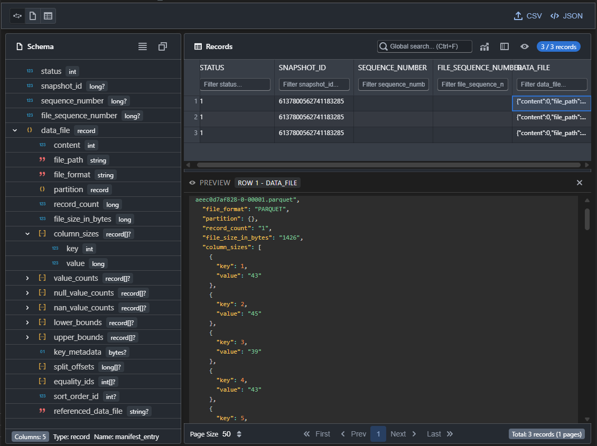

# Avro Explorer

<div align="center">


**A professional Visual Studio Code extension for viewing and exploring Apache Avro files**

[](https://marketplace.visualstudio.com/items?itemName=winse.avro-explorer)
[](https://marketplace.visualstudio.com/items?itemName=winse.avro-explorer)
[](https://marketplace.visualstudio.com/items?itemName=winse.avro-explorer)
[](https://open-vsx.org/extension/winse/avro-explorer)
[](LICENSE)

</div>

---

## 📸 UI Preview



A powerful Avro file viewer with interactive data table, schema display, and flexible view modes.

---

## ✨ Features

### 📊 Interactive Data Table

- Sort records by any column (click column header)
- **Virtualized Table** - Smooth scrolling of large datasets with `@blueprintjs/table`
- **Inline Column Filtering** - Filter records directly from each table column header
- Pagination with customizable page size
- Row selection with Windows-style highlighting
- Export selected or all data

### 📋 Schema Display

- Syntax-highlighted JSON schema view
- Quick copy to clipboard
- Shows type, name, and field count

### ↔️ Flexible View Modes

- **Split View** - Schema and records side by side
- **Schema Only** - Focus on schema definition
- **Records Only** - Full-screen data exploration
- Resizable panels for custom layouts

### 🎨 Theme Aware

- **Blueprint 6 Dark Mode** - Automatic `bp6-dark` theme synchronization
- Consistent styling with editor colors
- Smooth hover and selection effects

### 💾 Export Capabilities

- Export to CSV (comma-separated values)
- Export to JSON (formatted with indentation)
- System save dialog for file location

## 🚀 Getting Started

### Quick Start

1. **Double-click** any `.avro` file in VSCode Explorer
2. Or **right-click** and select "Open in Avro Explorer"
3. The file opens in Avro Explorer panel

### View Mode Switching

| Icon | Mode    | Description                     |
| ---- | ------- | ------------------------------- |
| ⇆    | Split   | Schema and records side by side |
| 📋   | Schema  | Full schema view                |
| 📊   | Records | Full records table              |

### Filtering Records

1. Use the search box to filter across all columns
2. Or select a specific column from the dropdown
3. Results update in real-time

### Sorting Records

Click on any column header to sort ascending/descending.

### Exporting Data

1. Click CSV or JSON button in the toolbar
2. Choose save location in the dialog
3. Data is exported in your chosen format

## 📋 Requirements

- **Visual Studio Code**: 1.78.0 or higher
- **Operating System**: Windows, macOS, Linux
- **Avro Files**: Uncompressed Avro files only

> **Note**: This extension does not support compressed Avro files (deflate, snappy, or other compression codecs).

## ⌨️ Commands

| Command              | Description                        |
| -------------------- | ---------------------------------- |
| `avro-explorer.open` | Open current file in Avro Explorer |

Access via `Ctrl+Shift+P` (or `Cmd+Shift+P` on Mac):

1. Type "Avro Explorer"
2. Select the command

## 🛠️ Development

### Prerequisites

- Node.js 18+
- npm or yarn
- VSCode for testing

### Setup

```bash
# Clone the repository
git clone https://github.com/winse/avro-explorer.git
cd avro-explorer

# Install dependencies
npm install

# Start development watch mode
npm run watch
```

### Build

```bash
# Compile and bundle (development)
npm run compile

# Production build (generates .vsix)
npm run package
```

### Project Structure

```
avro-explorer/
├── src/                     # Extension source (TypeScript)
│   ├── commands/           # VSCode commands
│   ├── webview/            # Message handlers and providers
│   └── extension.ts        # Extension entry point
├── webview/                # React WebView application
│   ├── src/
│   │   ├── components/     # React components
│   │   ├── hooks/          # Custom React hooks
│   │   ├── styles/         # CSS styles
│   │   └── utils/          # Utility functions
│   └── package.json        # Web dependencies
├── images/                 # Icons and assets
├── esbuild.config.js       # Bundler configuration
├── tsconfig.json           # TypeScript config (extension)
├── webview/tsconfig.json   # TypeScript config (webview)
└── package.json            # Extension manifest
```

### Tech Stack

- **Extension**: TypeScript + esbuild
- **WebView**: React 18 + TypeScript
- **UI Framework**: Blueprint 6 (Section, SectionCard, Table2)
- **Virtualized Table**: @blueprintjs/table
- **Syntax Highlighting**: Prism.js
- **Linting**: ESLint + Prettier

## 📝 Extension Manifest

```json
{
  "name": "avro-explorer",
  "displayName": "Avro Explorer",
  "publisher": "winse",
  "version": "0.3.1",
  "engines": {
    "vscode": "^1.78.0"
  },
  "categories": ["Visualization"],
  "keywords": ["avro", "explorer", "viewer", "data", "schema"],
  "activationEvents": [
    "onCustomEditor:avro-explorer.avroEditor",
    "onCommand:avro-explorer.open"
  ],
  "main": "./dist/extension.js",
  "contributes": {
    "commands": [...],
    "customEditors": [...]
  }
}
```

## 🤝 Contributing

Contributions are welcome! Please feel free to submit a Pull Request.

1. Fork the repository
2. Create your feature branch (`git checkout -b feature/AmazingFeature`)
3. Commit your changes (`git commit -m 'Add some AmazingFeature'`)
4. Push to the branch (`git push origin feature/AmazingFeature`)
5. Open a Pull Request

## 📄 License

This project is licensed under the Apache License 2.0 - see the [LICENSE](LICENSE) file for details.

## 🙏 Acknowledgments

- [Apache Avro](https://avro.apache.org/) - Data serialization format
- [Blueprint 6](https://blueprintjs.com/) - React UI framework
- [Prism.js](https://prismjs.com/) - Syntax highlighting
- [Original avro-viewer](https://github.com/yasunari89/avro-viewer) by Yasunari Ota

---

<div align="center">

**Made with ❤️ by [winse](https://github.com/winse)**

</div>
