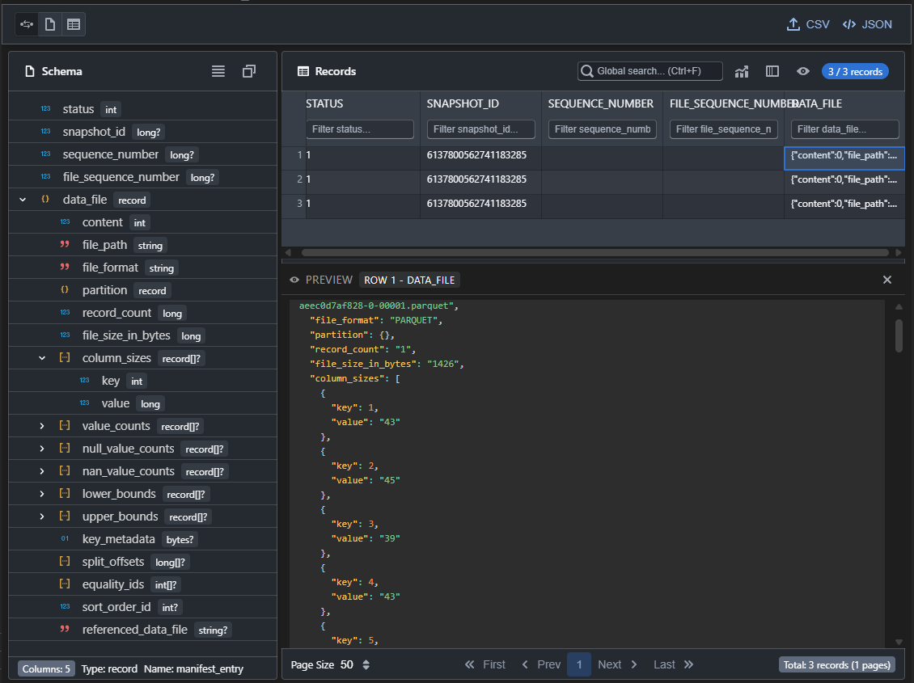

# Avro Explorer

<div align="center">


**A professional Visual Studio Code extension for viewing and exploring Apache Avro files**

[](https://marketplace.visualstudio.com/items?itemName=winse.avro-explorer)
[](https://open-vsx.org/extension/winse/avro-explorer)
[](LICENSE)

</div>

---

## 📸 UI Preview



A powerful Avro file viewer with interactive data table, schema display, and flexible view modes.

---

## ✨ Features

### 📊 Interactive Data Table

- Sort records by any column (click column header)
- **Virtualized Table** - Smooth scrolling of large datasets with `@blueprintjs/table`
- **Inline Column Filtering** - Filter records directly from each table column header
- **Cell Preview Panel** - Click any cell to preview full content in resizable panel with JSON syntax highlighting
- Pagination with customizable page size
- Row selection with Windows-style highlighting
- Export selected or all data
- **🔍 Global Search** - Search across all columns with Ctrl+F shortcut
- **📊 Column Charts** - Visual distribution charts for column values
- **📐 Column Operations** - Show/hide columns, drag to reorder

### 📋 Schema Display

- Syntax-highlighted JSON schema view
- Quick copy to clipboard
- Shows type, name, and field count
- **🔄 Two Modes** - Fields list and JSON view switching

### ↔️ Flexible View Modes

- **Split View** - Schema and records side by side
- **Schema Only** - Focus on schema definition
- **Records Only** - Full-screen data exploration
- Resizable panels for custom layouts

### 🎨 Theme Aware

- **Blueprint 6 Dark Mode** - Automatic `bp6-dark` theme synchronization
- Consistent styling with editor colors
- Smooth hover and selection effects

### 💾 Export Capabilities

- Export to CSV (comma-separated values)
- Export to JSON (formatted with indentation)
- System save dialog for file location

## 🚀 Getting Started

### Quick Start

1. **Double-click** any `.avro` file in Explorer
2. Or **right-click** -> **Open With...** -> `Avro Explorer`
3. Or run command palette: `Open in Avro Explorer`

### View Mode Switching

| Icon | Mode    | Description                     |
| ---- | ------- | ------------------------------- |
| ⇆    | Split   | Schema and records side by side |
| 📋   | Schema  | Full schema view                |
| 📊   | Records | Full records table              |

### Filtering Records

1. Use the search box to filter across all columns
2. Or select a specific column from the dropdown
3. Results update in real-time

### Sorting Records

Click on any column header to sort ascending/descending.

### Exporting Data

1. Click CSV or JSON button in the toolbar
2. Choose save location in the dialog
3. Data is exported in your chosen format

### Previewing Cell Content

1. Click on any cell in the data table
2. A preview panel appears showing the full content
3. For JSON objects, syntax highlighting is applied
4. Drag the resizer to adjust panel height
5. Toggle preview visibility with the eye icon in toolbar

## 📋 Requirements

- **Visual Studio Code**: 1.78.0 or higher
- **Operating System**: Windows, macOS, Linux
- **Avro Files**: Supports uncompressed and compressed Avro files (deflate, snappy)

> **Note**: Supports both uncompressed and compressed Avro files. Long type values are automatically converted to strings for JavaScript compatibility.

## ⌨️ Commands

| Command              | Description                        |
| -------------------- | ---------------------------------- |
| `avro-explorer.open` | Open current file in Avro Explorer |

Access via `Ctrl+Shift+P` (or `Cmd+Shift+P` on Mac):

1. Type "Avro Explorer"
2. Select the command

## 🛠️ Development

### Prerequisites

- Node.js 18+
- npm or yarn
- VSCode for testing

### Setup

```bash
# Clone the repository
git clone https://github.com/winse/data-viewer

git clone https://github.com/winse/avro-explorer.git
cd avro-explorer

# Install dependencies
npm install

# Start development watch mode
npm run watch
```

### Build

```bash
# Compile and bundle (development)
npm run compile

# Production build (generates .vsix)
npm run package
```

### Project Structure

```
data-viewer/           # Shared UI components library
avro-explorer/
├── src/                     # Extension source (TypeScript)
│   ├── commands/           # VSCode commands
│   ├── webview/            # Message handlers and providers
│   └── extension.ts        # Extension entry point
├── webview/                # React WebView application
│   ├── src/
│   │   ├── components/     # React components
│   │   ├── hooks/          # Custom React hooks
│   │   ├── styles/         # CSS styles
│   │   └── utils/          # Utility functions
│   └── package.json        # Web dependencies
├── images/                 # Icons and assets
├── esbuild.config.js       # Bundler configuration
├── tsconfig.json           # TypeScript config (extension)
├── webview/tsconfig.json   # TypeScript config (webview)
└── package.json            # Extension manifest
```

### Tech Stack

- **Extension**: TypeScript + esbuild
- **WebView**: React 18 + TypeScript
- **UI Framework**: Blueprint 6 (Section, SectionCard, Table2)
- **Virtualized Table**: @blueprintjs/table
- **Syntax Highlighting**: Prism.js
- **Linting**: ESLint + Prettier
- **data-viewer**: Shared UI components library (used by both Parquet and Avro explorers)

## 📝 Extension Manifest

```json
{
  "name": "avro-explorer",
  "displayName": "Avro Explorer",
  "publisher": "winse",
  "version": "0.5.1",
  "engines": {
    "vscode": "^1.78.0"
  },
  "categories": ["Visualization"],
  "keywords": ["avro", "explorer", "viewer", "data", "schema"],
  "activationEvents": [
    "onCustomEditor:avro-explorer.avroEditor",
    "onCommand:avro-explorer.open"
  ],
  "main": "./dist/extension.js",
  "contributes": {
    "commands": [...],
    "customEditors": [...]
  }
}
```

## 🤝 Contributing

Contributions are welcome! Please feel free to submit a Pull Request.

1. Fork the repository
2. Create your feature branch (`git checkout -b feature/AmazingFeature`)
3. Commit your changes (`git commit -m 'Add some AmazingFeature'`)
4. Push to the branch (`git push origin feature/AmazingFeature`)
5. Open a Pull Request

## 📄 License

This project is licensed under the Apache License 2.0 - see the [LICENSE](LICENSE) file for details.

## 🙏 Acknowledgments

- [Apache Avro](https://avro.apache.org/) - Data serialization format
- [Blueprint 6](https://blueprintjs.com/) - React UI framework
- [Prism.js](https://prismjs.com/) - Syntax highlighting
- [Original avro-viewer](https://github.com/yasunari89/avro-viewer) by Yasunari Ota

---

<div align="center">

**Made with ❤️ by [winse](https://github.com/winse)**

</div>
